# Kho Lưu Trữ Khóa Học Android Programming

**Mã Sinh Viên:** 65131182

Một bộ sưu tập toàn diện các dự án ứng dụng Android minh họa các khái niệm cơ bản trong phát triển Android, từ bố cục giao diện cơ bản đến xử lý sự kiện, xác thực dữ liệu và các mẫu tương tác người dùng.

---

## 📚 Về Kho Lưu Trữ Này

Kho lưu trữ này chứa toàn bộ code, tài liệu và bài lab của môn học Android Programming. Các dự án được cấu trúc theo một trình độ học tập, bắt đầu từ những khái niệm giao diện cơ bản và nâng cao lên các mẫu xử lý sự kiện và xác thực phức tạp hơn.

---

## 📱 Tổng Quan Các Dự Án

### 20. **Thi Giữa Kỳ 2 - 65131182**

COMMIT LẦN THỨ 6:
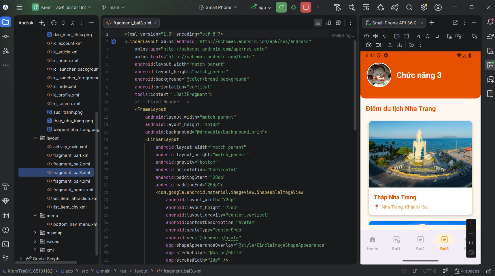

COMMIT LẦN THỨ 5:
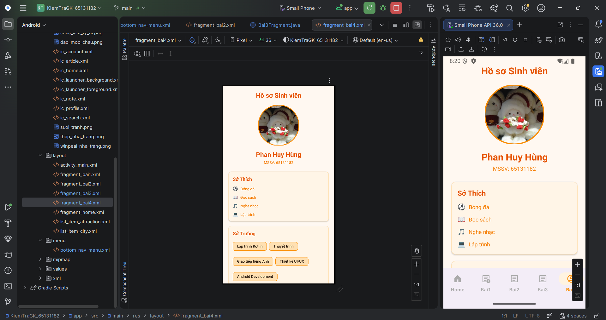

COMMIT LẦN THỨ4:
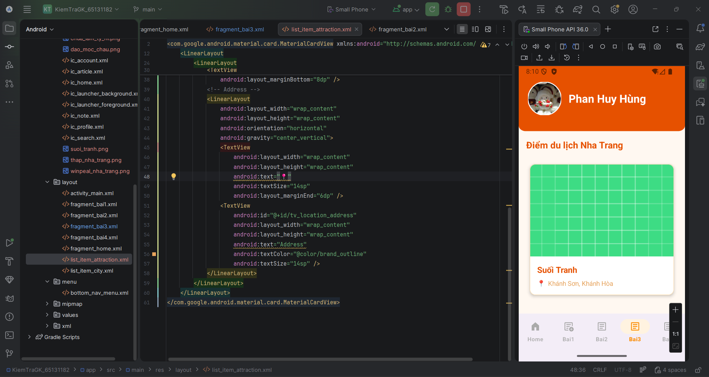

COMMIT LẦN THỨ 3:
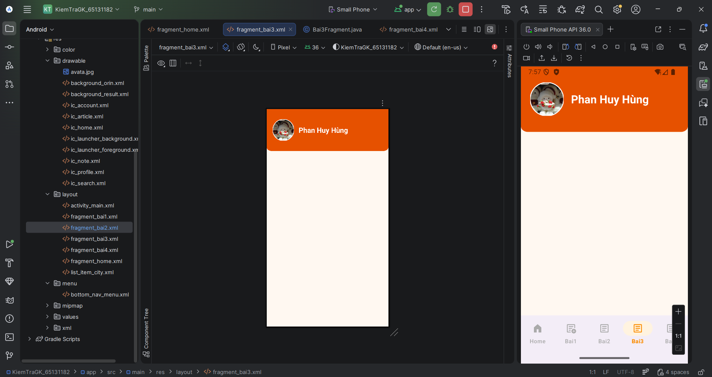

COMMIT LẦN THỨ 2:
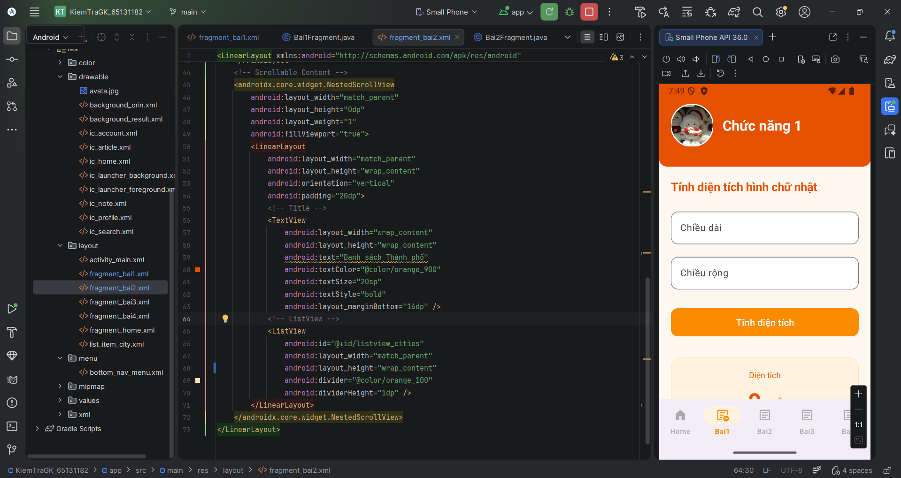

COMMIT LẦN THỨ 1:
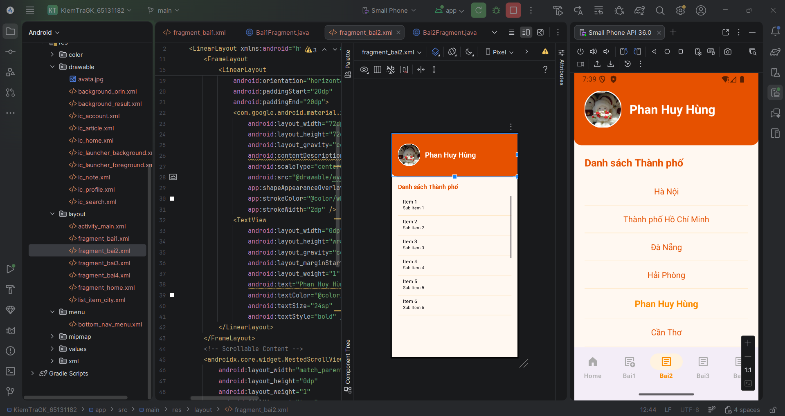

### 19. **BottomNavigation**

[Chi tiết](./mobile-java-native/Lab06-BottomNavigation/app/src/main/java/hyhung/bottomnavigation/MainActivity.java)

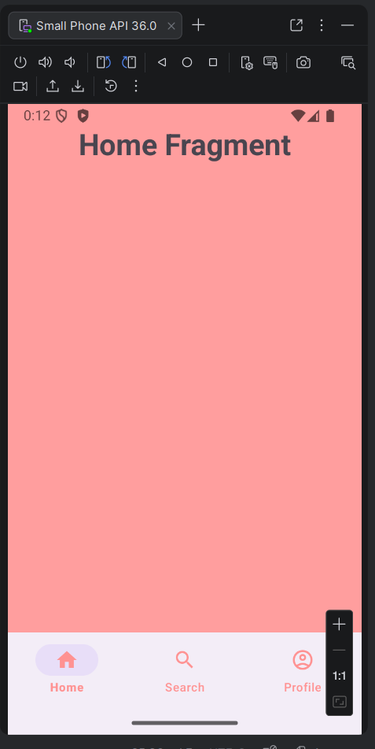 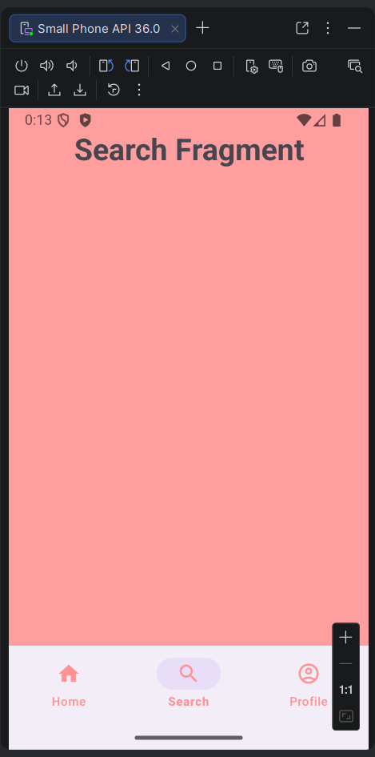 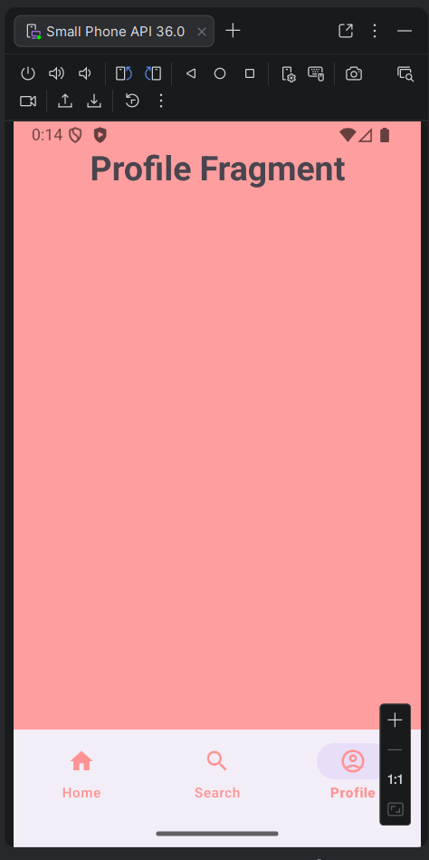

- **Mục Đích:** Minh họa cách sử dụng Bottom Navigation để điều hướng nhanh giữa các Fragment chính trong một ứng dụng Android
- **Khái Niệm Chính:** BottomNavigationView, Fragment, FragmentManager, FragmentTransaction, vector drawable icon
- **Tính Năng:**
  - Hiển thị thanh điều hướng phía dưới với 3 mục Home, Search, Profile
  - Chuyển Fragment theo từng mục được chọn trên Bottom Navigation
  - Sử dụng menu XML và icon vector từ drawable
- **Trọng Tâm Học Tập:** Nắm cách tổ chức điều hướng đa màn hình bằng Bottom Navigation và Fragment trong Android

### 18. **BaiTH13ThayDoiFragment**

[Chi tiết](./BaiTH13ThayDoiFragment/app/src/main/java/hyhung/baith13thaydoifragment/MainActivity.java)
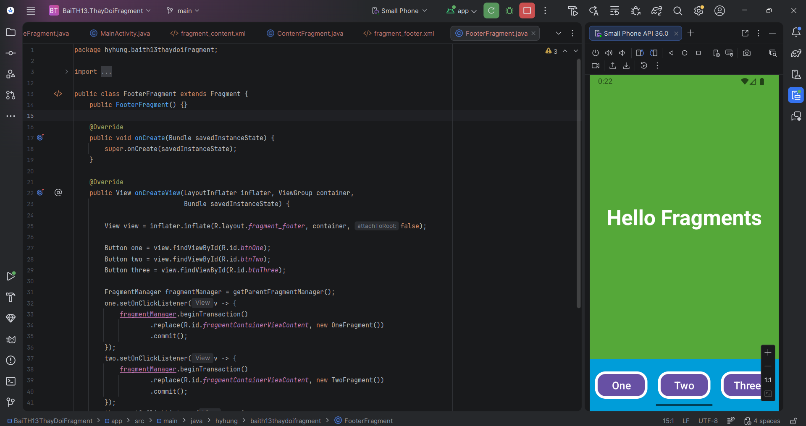
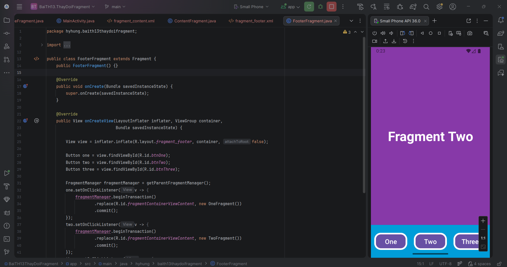
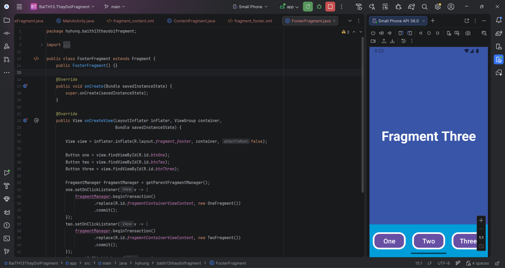

- **Mục Đích:** Minh họa thay đổi (replace) Fragment theo thao tác người dùng để cập nhật nội dung màn hình linh hoạt
- **Khái Niệm Chính:** FragmentContainerView, FragmentManager (`getParentFragmentManager()`), FragmentTransaction, `replace()`, UI modularity
- **Tính Năng:**
  - Chia UI thành 2 vùng: Content (hiển thị nội dung) và Footer (3 nút One/Two/Three)
  - Khi bấm nút ở Footer, thay thế fragment nội dung bằng `OneFragment` / `TwoFragment` / `ThreeFragment`
  - Tổ chức theo mô hình “container → fragment” giúp dễ mở rộng/tái sử dụng
- **Trọng Tâm Học Tập:** Nắm thao tác `replace()` fragment vào container và cách điều phối UI giữa các fragment trong cùng một activity

### 17. **BaiTH12FragmentDong**

[Chi tiết](./BaiTH12FragmentDong/app/src/main/java/hyhung/baith12fragmentdong/MainActivity.java)
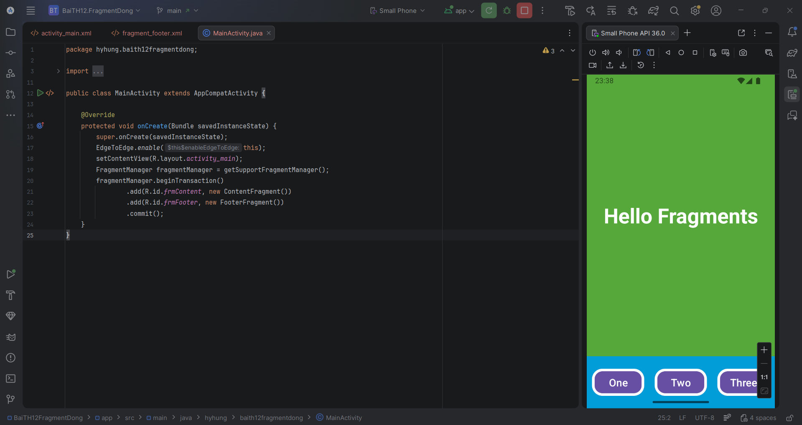

- **Mục Đích:** Minh họa cách thêm Fragment động (dynamic) vào Activity bằng `FragmentManager` để quản lý UI theo từng vùng (Content/Footer)
- **Khái Niệm Chính:** Fragment, FragmentManager, FragmentTransaction, `add()`, FrameLayout container, `onCreateView()`
- **Tính Năng:**
  - Tạo 2 vùng chứa bằng `FrameLayout`: `frmContent` và `frmFooter`
  - Add `ContentFragment` và `FooterFragment` vào container bằng code trong `MainActivity`
  - Tách UI thành 2 fragment độc lập, dễ tái sử dụng và mở rộng
- **Trọng Tâm Học Tập:** Nắm luồng thao tác thêm Fragment động và cách tổ chức layout “container → fragment” trong ứng dụng Android

### 16. **BaiTH11FragmentTinh**

[Chi tiết](./BaiTH11FragmentTinh/app/src/main/java/hyhung/baith11fragmenttinh/MainActivity.java)
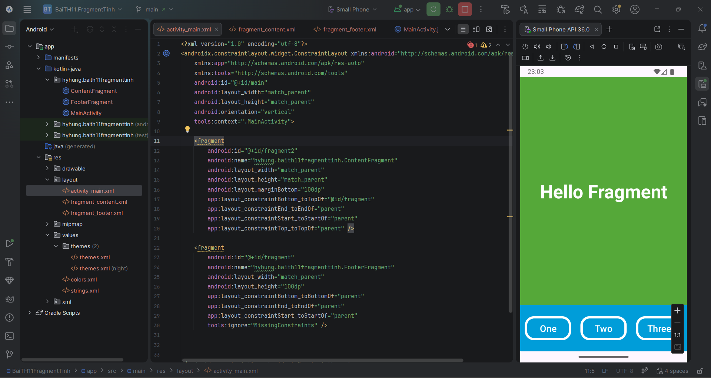

- **Mục Đích:** Minh họa cách thêm Fragment tĩnh (static) vào Activity để chia nhỏ UI thành các khối tựa như Content/Footer
- **Khái Niệm Chính:** Fragment, static fragment (`<fragment>`), `onCreateView()`, LayoutInflater, UI modularity
- **Tính Năng:**
  - Hiển thị `ContentFragment` ở khu vực nội dung chính (TextView)
  - Hiển thị `FooterFragment` ở phía dưới với 3 nút (One/Two/Three)
  - Tạo bố cục 2 vùng và gắn fragment trực tiếp trong XML `activity_main.xml`
- **Trọng Tâm Học Tập:** Nắm cách tạo Fragment, inflate layout trong Fragment và nhúng Fragment tĩnh vào Activity bằng XML

### 15. **BaiTH10_ViduIntentDonGian**

[Chi tiết](./Intent_ViDu1/app/src/main/java/hyhung/intentvidu1/MainActivity.java)
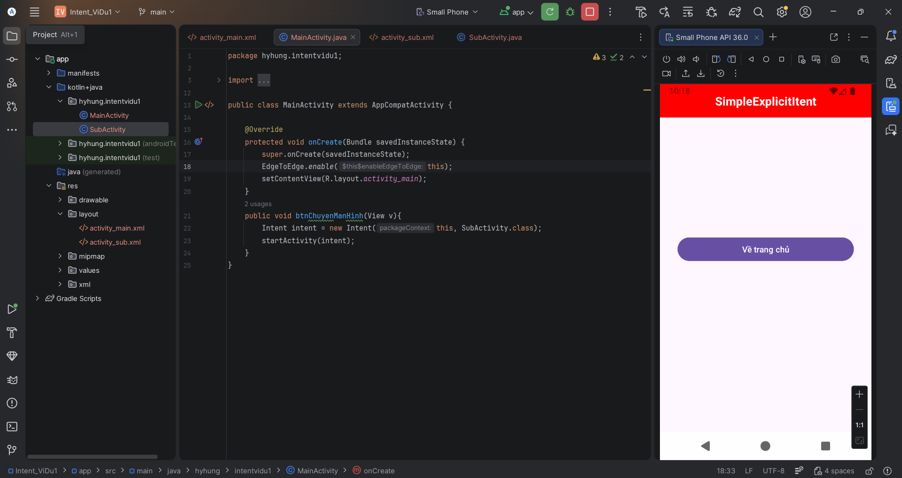

- **Mục Đích:** Minh họa cách dùng explicit intent để chuyển qua lại giữa hai Activity
- **Khái Niệm Chính:** Intent, Explicit Intent, startActivity(), android:onClick, điều hướng màn hình
- **Tính Năng:**
  - Mở SubActivity từ MainActivity bằng Intent tường minh
  - Quay lại MainActivity từ SubActivity bằng nút bấm riêng
  - Minh họa luồng chuyển màn hình hai chiều trong ứng dụng Android
- **Trọng Tâm Học Tập:** Nắm cách tạo và sử dụng Intent tường minh để điều hướng giữa các Activity

### 14. **TH_Intent**

[Chi tiết](./TH_Intent/app/src/main/java/hyhung/th_intent/MainActivity.java)
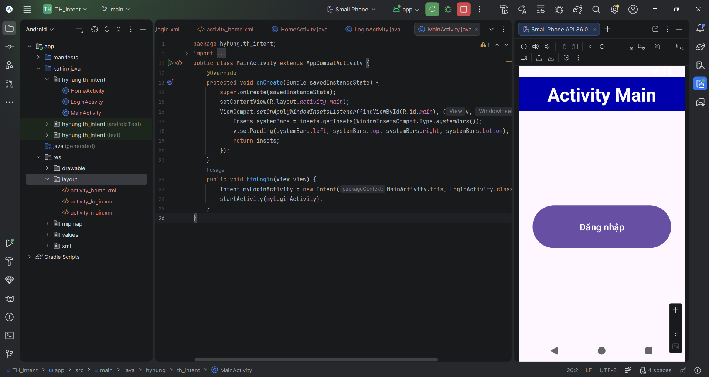
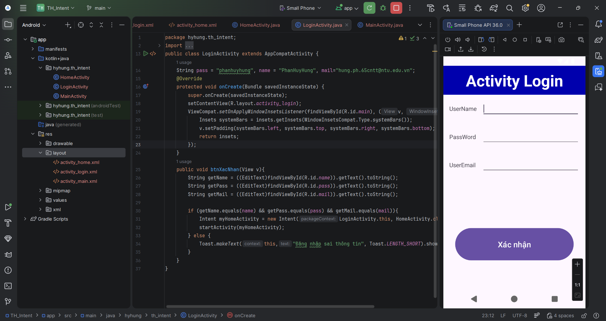
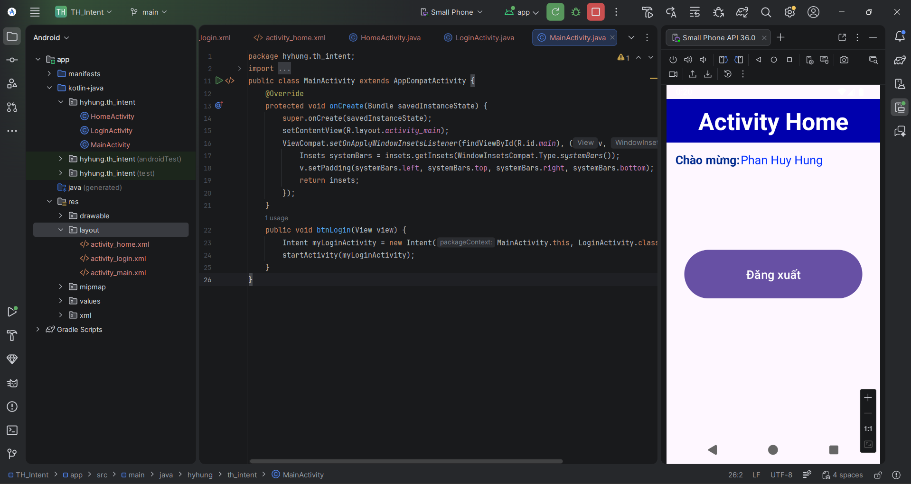

- **Mục Đích:** Minh họa cách sử dụng Intent để chuyển màn hình và trao đổi dữ liệu giữa các Activity
- **Khái Niệm Chính:** Intent, Explicit Intent, Implicit Intent, startActivityForResult, putExtra
- **Tính Năng:**
  - Mở màn hình đăng nhập và màn hình trang chủ bằng Intent tường minh
  - Chuyển dữ liệu giữa các màn hình bằng Intent extras
  - Minh họa xử lý luồng điều hướng trong ứng dụng Android
- **Trọng Tâm Học Tập:** Nắm cách tạo và sử dụng Intent trong ứng dụng thực tế

### 13. **BaiTH9_Recyclerview_DanhSachCanhDep**

[Chi tiết](./BaiTH9_Recyclerview_DanhSachCanhDep/app/src/main/java/hyhung/baith9_recyclerview_danhsachcanhdep/MainActivity.java)
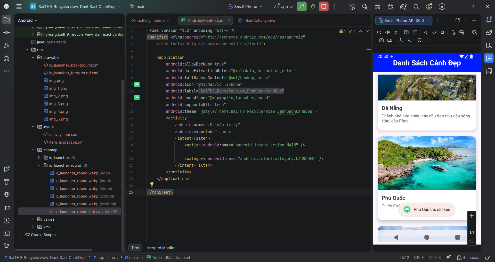

- **Mục Đích:** Minh họa cách sử dụng RecyclerView để hiển thị danh sách cảnh đẹp Việt Nam
- **Khái Niệm Chính:** RecyclerView, Adapter, ViewHolder, LinearLayoutManager, custom item layout
- **Tính Năng:**
  - Hiển thị danh sách nhiều địa điểm/cảnh đẹp bằng RecyclerView
  - Mỗi item có hình ảnh, tiêu đề và mô tả ngắn
  - Xử lý sự kiện click từng phần tử bằng Toast
  - Tách giao diện theo layout riêng cho item dọc và ngang
- **Trọng Tâm Học Tập:** Làm việc với RecyclerView, adapter tùy biến và tổ chức dữ liệu danh sách hiệu quả

### 12. **BaiTH8_TuyChinhLV**

[Chi tiết](./BaiTH8_TuyChinhLV/app/src/main/java/hyhung/baith8_tuychinhlv/MainActivity.java)
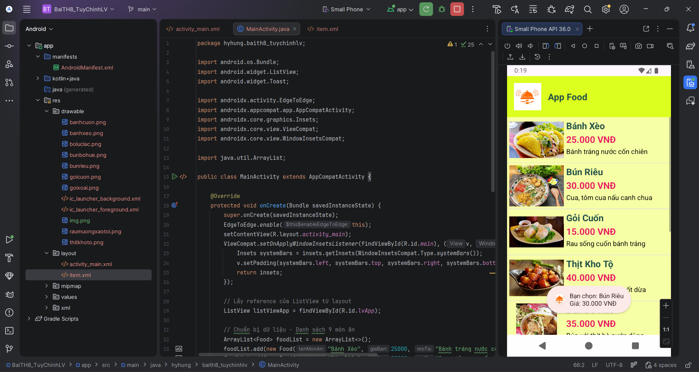

- **Mục Đích:** Minh họa Custom Adapter và ListView để hiển thị danh sách các món ăn Việt Nam
- **Khái Niệm Chính:** Custom Adapter, ListView, custom item layout, ArrayList
- **Tính Năng:**
  - Hiển thị danh sách 9 món ăn nổi tiếng Việt Nam
  - Mỗi phần tử hiển thị hình ảnh, tên, giá, mô tả
  - Xử lý sự kiện click trên từng món ăn
  - Custom item layout với ImageView và TextView
- **Trọng Tâm Học Tập:** Custom Adapter, custom item layout, xử lý dữ liệu phức tạp trong ListView

### 11. **DocBaoTongHop**

[Chi tiết](./DocBaoTongHop/app/src/main/res/layout/activity_tieu_de_bao.xml)
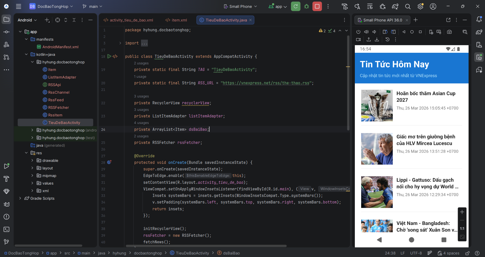

- **Mục Đích:** Ứng dụng đọc tin RSS từ VNExpress, minh họa cách sử dụng RecyclerView và fetch dữ liệu từ mạng
- **Khái Niệm Chính:** RecyclerView, Adapter, RSS API, Xử lý luồng mạng, JSON Parsing
- **Tính Năng:**
  - Hiển thị danh sách tin tức từ RSS feed
  - Fetch dữ liệu tin tức từ VNExpress qua API
  - Sử dụng RecyclerView cho hiển thị danh sách tối ưu
  - Header tùy chỉnh với tiêu đề và mô tả
  - Xử lý lỗi mạng và load dữ liệu không đồng bộ
- **Trọng Tâm Học Tập:** RecyclerView, Networking, RSS feed parsing, Adapter pattern

### 10. **BaiTH7_ListView_DanhSachTinhThanh**

[Chi tiết](./BaiTH7_ListView_DanhSachTinhThanh/app/src/main/java/hyhung/baith7_listview_danhsachtinhthanh/MainActivity.java)
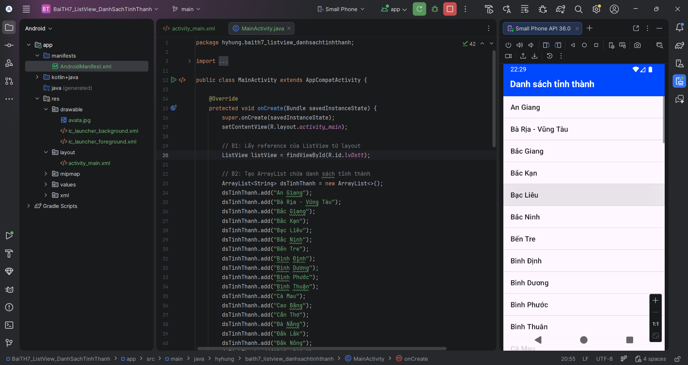

- **Mục Đích:** Minh họa cách sử dụng ListView để hiển thị danh sách các tỉnh thành của Việt Nam
- **Khái Niệm Chính:** ListView, ArrayAdapter, OnItemClickListener, Toast thông báo
- **Tính Năng:**
  - Hiển thị danh sách đầy đủ 63 tỉnh thành của Việt Nam
  - Xử lý sự kiện click trên từng tỉnh thành
  - Hiển thị Toast thông báo tỉnh thành được chọn
  - Giao diện đơn giản và trực quan
- **Trọng Tâm Học Tập:** Sử dụng ListView với ArrayList và xử lý sự kiện OnItemClickListener

### 9. **BaiTH7_ListView**

[Chi tiết](./BaiTH7_ListView/app/src/main/res/layout/activity_main.xml)
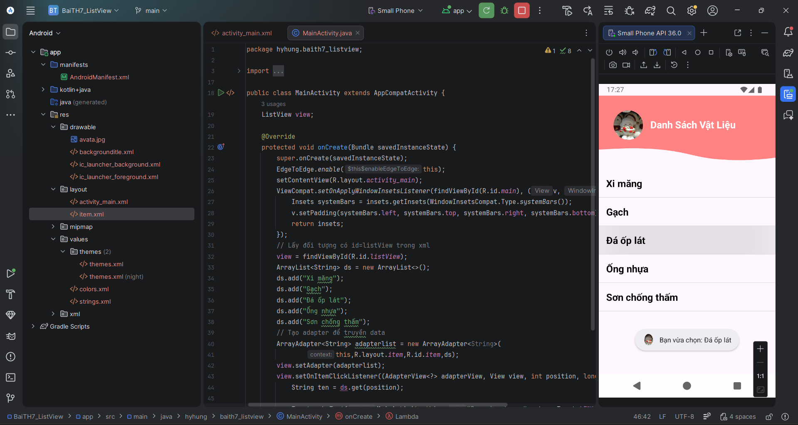

- **Mục Đích:** Minh họa cách sử dụng ListView để hiển thị danh sách các phần tử
- **Khái Niệm Chính:** ListView, ArrayAdapter, OnItemClickListener, custom item layout
- **Tính Năng:**
  - Hiển thị danh sách các vật liệu xây dựng
  - Xử lý sự kiện click trên từng phần tử listview
  - Hiển thị Toast thông báo phần tử được chọn
  - Thiết kế header với avatar và tiêu đề tùy chỉnh
- **Trọng Tâm Học Tập:** Sử dụng ListView và Adapter để hiển thị dữ liệu động

### 8. **BaiTH5_EventHandling_Calculator_AnonymousListener**

[Chi tiết](./BaiTH5_EventHandling_Calculator_AnonymousListener/app/src/main/res/layout/activity_main.xml)
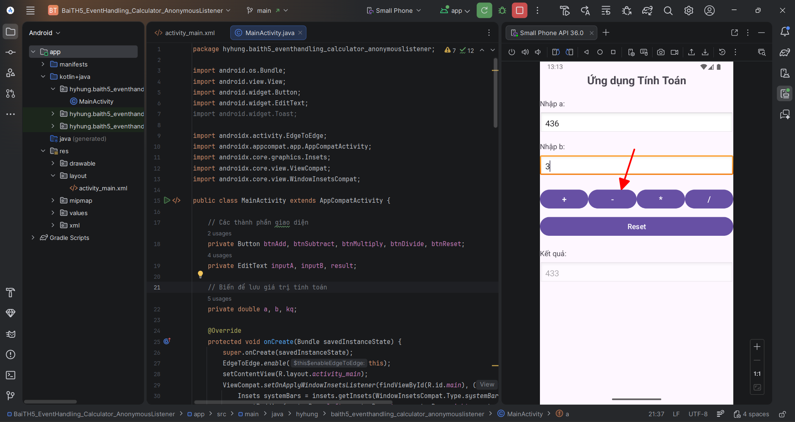

- **Mục Đích:** Minh họa mẫu trình nghe ẩn danh để xử lý sự kiện
- **Khái Niệm Chính:** setOnClickListener(), lớp nội tại, các sự kiện nhấp nút
- **Tính Năng:** Máy tính hoàn chỉnh (cộng, trừ, nhân, chia, đặt lại)
- **Trọng Tâm Học Tập:** Xử lý sự kiện lập trình với các trình nghe ẩn danh

### 7. **BaiTH6_EventHandling_Sum_OnClick**

[Chi tiết](./BaiTH6_EventHandling_Sum_OnClick/app/src/main/res/layout/activity_main.xml)
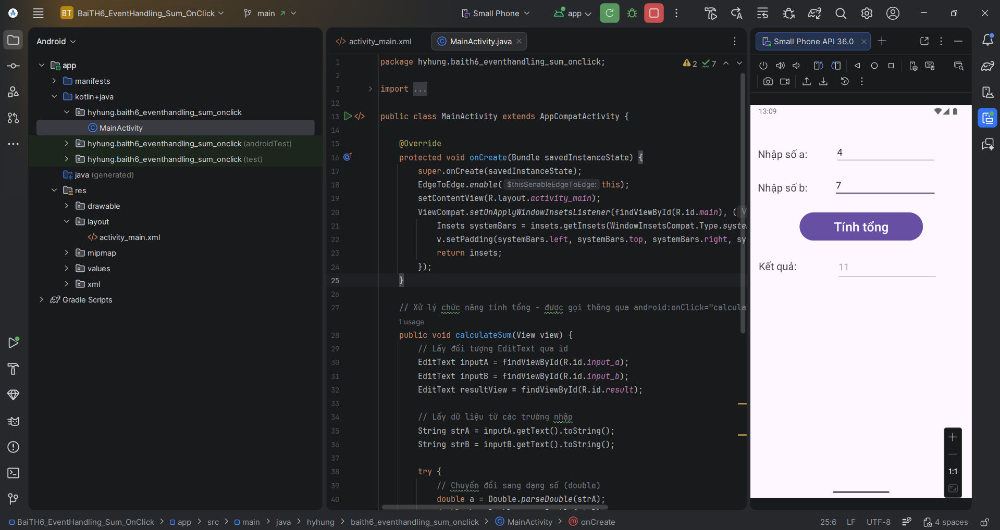

- **Mục Đích:** Minh họa phương pháp xử lý sự kiện android:onClick
- **Tính Năng:** Máy tính tổng đơn giản sử dụng ràng buộc thuộc tính phương thức
- **Trọng Tâm Học Tập:** Xử lý sự kiện khai báo trong bố cục XML

### 6. **CalculatorsWithLinearLayout**

[Chi tiết](./CalculatorsWithLinearLayout/app/src/main/res/layout/activity_main.xml)
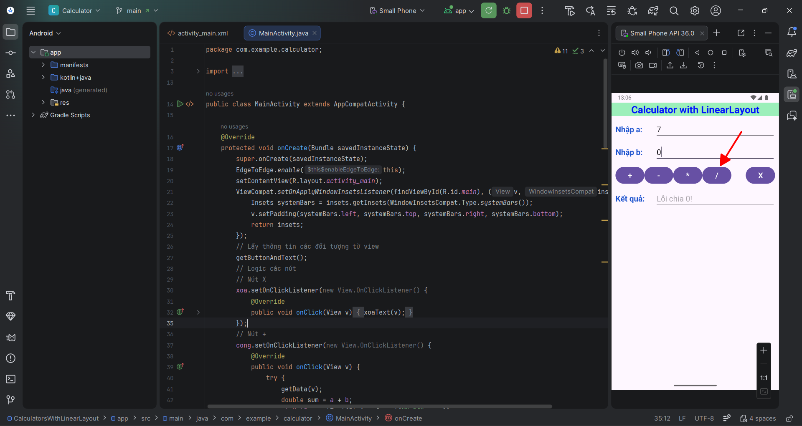

- **Mục Đích:** Máy tính đầy đủ tính năng với giao diện dựa trên LinearLayout
- **Khái Niệm Chính:** Lớp nội tại ẩn danh, các đối tượng OnClickListener, bố cục phức tạp
- **Tính Năng:** Các phép toán hoàn chỉnh (+, −, ×, ÷), chức năng đặt lại, xử lý lỗi
- **Trọng Tâm Học Tập:** Mẫu trình nghe ẩn danh và thiết kế bố cục

### 5. **BMICalculator**

[Chi tiết](./BMICalculator/app/src/main/res/layout/activity_main.xml)
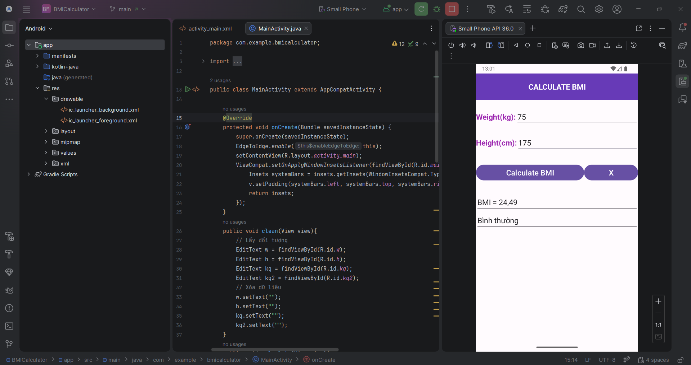

- **Mục Đích:** Máy tính Chỉ số Khối Lượng Cơ Thể (BMI) với phân loại sức khỏe
- **Khái Niệm Chính:** Tính toán toán học, xác thực đầu vào, phân loại kết quả
- **Tính Năng:**
  - Xác thực đầu vào cân nặng và chiều cao
  - Phân loại BMI (Thiếu cân, Bình thường, Thừa cân, Béo phì I/II/III)
  - Phân loại sức khỏe theo tiêu chuẩn WHO
- **Trọng Tâm Học Tập:** Xác thực dữ liệu và logic điều kiện

### 4. **CalculateSum**

[Chi tiết](./CalculateSum/app/src/main/res/layout/activity_main.xml)
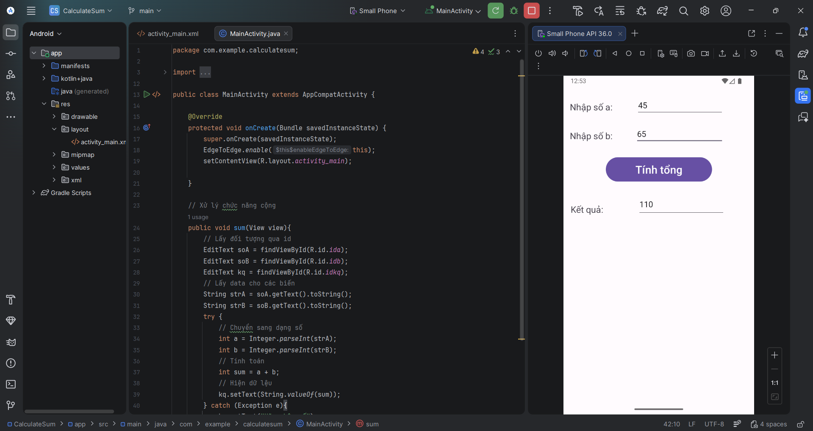

- **Mục Đích:** Máy tính cộng hai số đơn giản
- **Khái Niệm Chính:** Thuộc tính android:onClick, xử lý sự kiện dựa trên phương thức
- **Tính Năng:** Xác thực đầu vào, xử lý ngoại lệ cho các giá trị không phải số
- **Trọng Tâm Học Tập:** Sử dụng android:onClick để xử lý sự kiện

### 3. **Calculate**

[Chi tiết](./Calculate/app/src/main/res/layout/activity_main.xml)
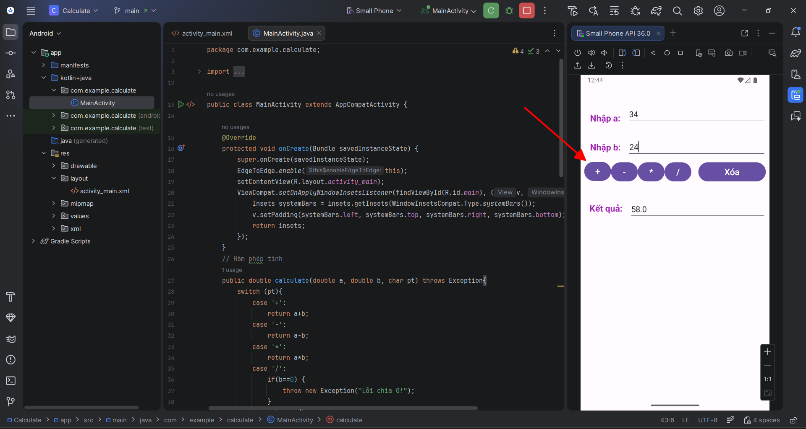

- **Mục Đích:** Ứng dụng máy tính cơ bản với bốn phép toán
- **Khái Niệm Chính:** View.OnClickListener, xử lý sự kiện thông qua phương thức, các phép toán
- **Tính Năng:** Cộng, trừ, nhân, chia, xác thực chia cho không
- **Trọng Tâm Học Tập:** Xử lý sự kiện với tham chiếu phương thức

### 2. **LinearLayout**

[Chi tiết](./LinearLayout/app/src/main/res/layout/activity_main.xml)
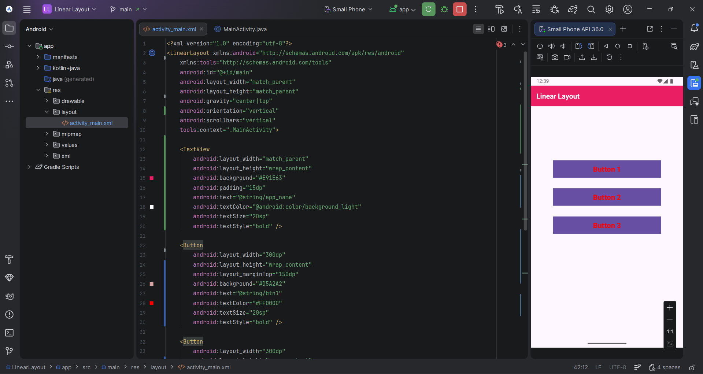

- **Mục Đích:** Nền tảng bố cục giao diện sử dụng LinearLayout
- **Khái Niệm Chính:** Thùng chứa LinearLayout, khoảng cách, khoảng cách đáp ứng
- **Trọng Tâm Học Tập:** Thiết kế giao diện cơ bản và quản lý bố cục

### 1. **HelloWorld**

[Chi tiết](./HelloWorld/app/src/main/res/layout/activity_main.xml)
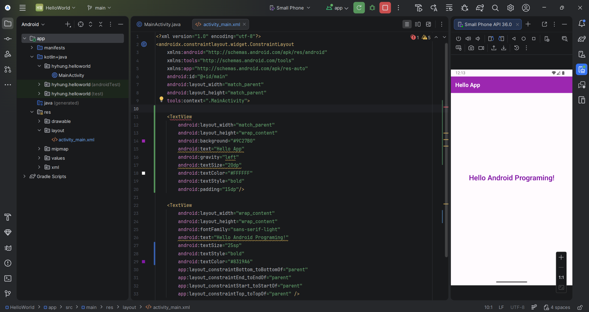

- **Mục Đích:** Dự án giới thiệu minh họa thiết lập hoạt động Android cơ bản
- **Khái Niệm Chính:** Cấu trúc hoạt động cơ bản, hiển thị từ cạnh tới cạnh, xử lý lề hệ thống
- **Trọng Tâm Học Tập:** Cấu trúc và cấu hình dự án Android

## 🛠️ Yêu Cầu

- **Android Studio** (khuyến nghị phiên bản mới nhất)
- **Java Development Kit (JDK)** phiên bản 11 hoặc cao hơn
- **Gradle** (bao gồm trong Android Studio)
- **Android SDK** API Level 21 hoặc cao hơn
- Kiến thức cơ bản về Java và các khái niệm Android

---

## 📝 Ghi Chú

- Mỗi dự án là độc lập và có thể chạy riêng biệt
- Các dự án sử dụng Gradle Kotlin DSL (tệp `.kts`) để cấu hình xây dựng hiện đại
- Một số dự án sử dụng tập lệnh xây dựng Gradle truyền thống (tệp `.gradle`)
- Tất cả các dự án hướng đến Android API Level 21+ để tương thích thiết bị rộng

---

**Cập Nhật Lần Cuối:** Tháng 4 năm 2026
**Chủ Sở Hữu Kho Lưu Trữ:** Phan Huy Hùng - 65131182
