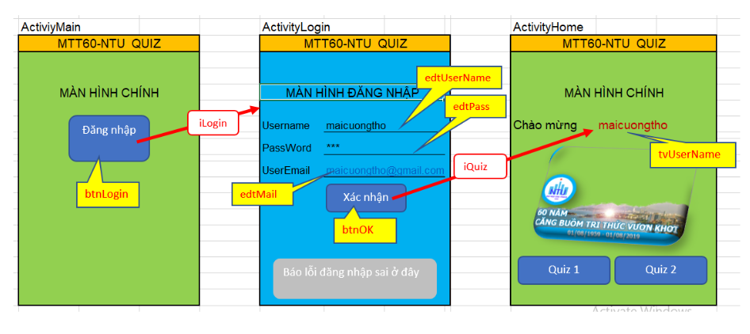

# Lab 04 · Intent

**Mục tiêu:** Hiểu cách Android dùng `Intent` để giao tiếp giữa các thành phần như `Activity`, `Service`, `BroadcastReceiver` và cách truyền dữ liệu giữa hai màn hình.

**Ảnh minh hoạ:** 

---

## 1. Giới thiệu về Intent

`Intent` là đối tượng dùng để mô tả một hành động cần thực hiện trong Android. Có thể xem nó như một “lá thư” chứa địa chỉ nhận và nội dung cần gửi.

- `Intent` giúp giao tiếp giữa các thành phần trong Android OS: `Activity`, `Service`, `Provider`, `Receiver`.
- `Intent Service` đóng vai trò giống như người chuyển thư, đưa intent đến thành phần phù hợp.
- Một intent thường gồm `action`, `data`, `category`, `type`, `component`, `extras`.

### Hai phần chính của Intent

- **Action:** Hành động cần thực hiện, ví dụ `ACTION_VIEW`, `ACTION_EDIT`, `ACTION_CALL`, `ACTION_SENDTO`.
- **Data:** Dữ liệu đầu vào cần để hành động đó hoạt động, ví dụ số điện thoại, ảnh, tin nhắn, URI.

### Khởi tạo Intent

```java
Intent myOtherActivity = new Intent(action, data);
startActivity(myOtherActivity);
```

Ví dụ sử dụng Intent tường minh khi người dùng bấm nút mở màn hình nhập số:

```java
public void btnNhap(View v) {
    Intent intent = new Intent(MainActivity.this, NhapSoActivity.class);
    startActivityForResult(intent, 1001);
}
```

Ví dụ sử dụng Intent ngầm định để mở trang web:

```java
public void btnMoWeb(View v) {
    Intent intent = new Intent(Intent.ACTION_VIEW);
    intent.setData(Uri.parse("https://www.google.com"));
    startActivity(intent);
}
```

Thực hành: 

### Ví dụ action/data thường gặp

| Action | Data | Ý nghĩa |
|---|---|---|
| `ACTION_DIAL` | `tel:5551234` | Mở trình quay số với số đã điền sẵn |
| `ACTION_VIEW` | `http://www.google.com` | Mở trang web trong trình duyệt |
| `ACTION_EDIT` | `content://contacts/people/2` | Chỉnh sửa liên hệ có mã 2 |
| `ACTION_VIEW` | `content://contacts/people/2` | Xem thông tin liên hệ có mã 2 |
| `ACTION_VIEW` | `content://contacts/people/` | Hiển thị danh sách liên hệ |

---

## 2. Sử dụng Intent để trao đổi dữ liệu

### Phía Activity gửi

- Đóng gói dữ liệu vào `Intent`.
- Chọn dữ liệu phù hợp để truyền qua `extras`.
- Gọi màn hình nhận bằng `startActivity(myIntent)`.
- Nếu muốn nhận kết quả trả về, dùng `startActivityForResult(myIntent, CODE)`.

```java
public void btnNhap(View v) {
    Intent i = new Intent(this, NhapSoActivity.class);
    startActivityForResult(i, 1001);
}

@Override
protected void onActivityResult(int requestCode, int resultCode, Intent data) {
    if (requestCode == 1001) {
        if (resultCode == RESULT_OK) {
            TextView t1 = (TextView) findViewById(R.id.textView1);
            TextView t2 = (TextView) findViewById(R.id.textView2);
            TextView t3 = (TextView) findViewById(R.id.textView3);
            String a = data.getStringExtra("SoA");
            String b = data.getStringExtra("SoB");
            t1.setText("A = " + a);
            t2.setText("B = " + b);
            t3.setText("Tổng = " + (Integer.parseInt(a) + Integer.parseInt(b)));
            Toast.makeText(this, "Trả về thành công", Toast.LENGTH_SHORT).show();
        } else {
            Toast.makeText(this, "Trả về thất bại", Toast.LENGTH_SHORT).show();
        }
    }
    super.onActivityResult(requestCode, resultCode, data);
}
```

### Phía Activity nhận

- Lấy intent được gửi tới bằng `getIntent()`.
- Khi muốn trả kết quả, dùng `setResult(RESULT_CANCELED)` hoặc `setResult(RESULT_OK, intent)`.
- Dữ liệu trả về thường được đưa vào `Intent` bằng `putExtra`.
- Với dữ liệu phức tạp có thể dùng `putSerializable` hoặc `Bundle`.

```java
public class NhapSoActivity extends Activity {

    @Override
    protected void onCreate(Bundle savedInstanceState) {
        super.onCreate(savedInstanceState);
        setContentView(R.layout.activity_nhap_so);
    }

    public void btnCancel(View v) {
        setResult(RESULT_CANCELED);
        finish();
    }

    public void btnOK(View v) {
        Intent i = new Intent();
        EditText t1 = (EditText) findViewById(R.id.editText1);
        EditText t2 = (EditText) findViewById(R.id.editText2);
        i.putExtra("SoA", t1.getText().toString());
        i.putExtra("SoB", t2.getText().toString());
        setResult(RESULT_OK, i);
        finish();
    }
}
```

---

## 3. Intent filter

`Intent filter` là bộ lọc cho biết một `Activity`, `Service` hoặc `BroadcastReceiver` có thể xử lý kiểu intent nào.

Khi hệ thống nhận một intent, nó sẽ phân giải theo thứ tự ưu tiên:

1. `Action` trong intent
2. Chuỗi tham số hoặc `URI` trong `data`
3. `Category` của intent

---

## 4. Intent tường minh và ngầm định

### Intent tường minh (Explicit Intent)

- Chỉ rõ component sẽ nhận intent.
- Dùng trong cùng một ứng dụng.
- Dữ liệu nên truyền qua `extras`.

```java
Intent intentABC = new Intent();
intentABC.setClassName("ten_package", "ten_class");
startActivity(intentABC);
```

Hoặc:

```java
Intent intentABC = new Intent(this, Activity2.class);
startActivity(intentABC);
```

### Intent ngầm định (Implicit Intent)

- Chỉ khai báo `action`, `category`, `data`,...
- Hệ thống tự tìm thành phần phù hợp nhất để xử lý.
- Dùng với dịch vụ hệ thống hoặc dịch vụ bên thứ ba.

Các trường hợp thường gặp:

| Dữ liệu | Action | Mô tả |
|---|---|---|
| `tel:phone_number` | `ACTION_VIEW` | Mở màn hình gọi điện |
| `tel:phone_number` | `ACTION_CALL` | Thực hiện cuộc gọi |
| `http://web_address` | `ACTION_VIEW` | Mở trình duyệt web |
| `https://web_address` | `ACTION_VIEW` | Mở trình duyệt web |
| `some_words` | `ACTION_WEB_SEARCH` | Tìm kiếm trên web |
| `sms://` | `ACTION_SENDTO` | Gửi tin nhắn |
| `geo:latitude,longitude` | `ACTION_VIEW` | Mở Maps tại vị trí chỉ định |

### Một số action định nghĩa sẵn

- `ACTION_MAIN`
- `ACTION_VIEW`
- `ACTION_EDIT`
- `ACTION_PICK`
- `ACTION_CHOOSER`
- `ACTION_GET_CONTENT`
- `ACTION_DIAL`
- `ACTION_CALL`
- `ACTION_SEND`
- `ACTION_SEARCH`
- `ACTION_WEB_SEARCH`
- `ACTION_SENDTO`

---

## 5. Các thành phần của Intent

| Thành phần | Ý nghĩa |
|---|---|
| `action` | Tên hành động mà intent yêu cầu thực hiện |
| `data` | Dữ liệu cần xử lý, thường biểu diễn bằng URI |
| `category` | Thông tin nhóm của action |
| `type` | Kiểu dữ liệu theo chuẩn MIME |
| `component` | Chỉ định cụ thể lớp sẽ thực thi Activity |
| `extras` | Các cặp `key/value` bổ sung, được lưu trong `Bundle` |

### Tóm tắt nhanh

- `component` là tên class xử lý intent.
- `data` thường dùng chuỗi URI như `tel:216-555-1234` hoặc `https://tinhoc123.edu.vn`.
- `extras` dùng khi dữ liệu phức tạp hoặc không cố định.
- `type` thường được hệ thống tự xác định.

---

## 6. Thực hành

Ảnh minh hoạ của bài học nằm tại [image.png](image.png).

### Bài tập gợi ý

- Mở màn hình nhập hai số bằng `Intent`.
- Trả dữ liệu về màn hình trước bằng `setResult`.
- Tính tổng hai số sau khi nhận kết quả.
- Thử mở trình duyệt, gọi điện và tìm kiếm web bằng implicit intent.

---

## 7. Ghi nhớ nhanh

- `Intent` dùng để gửi yêu cầu giữa các thành phần Android.
- `Explicit Intent` chỉ rõ đích đến.
- `Implicit Intent` để hệ thống tự chọn ứng dụng phù hợp.
- `startActivityForResult` dùng khi cần trả kết quả về màn hình trước.
- `putExtra` là cách phổ biến nhất để truyền dữ liệu đơn giản.